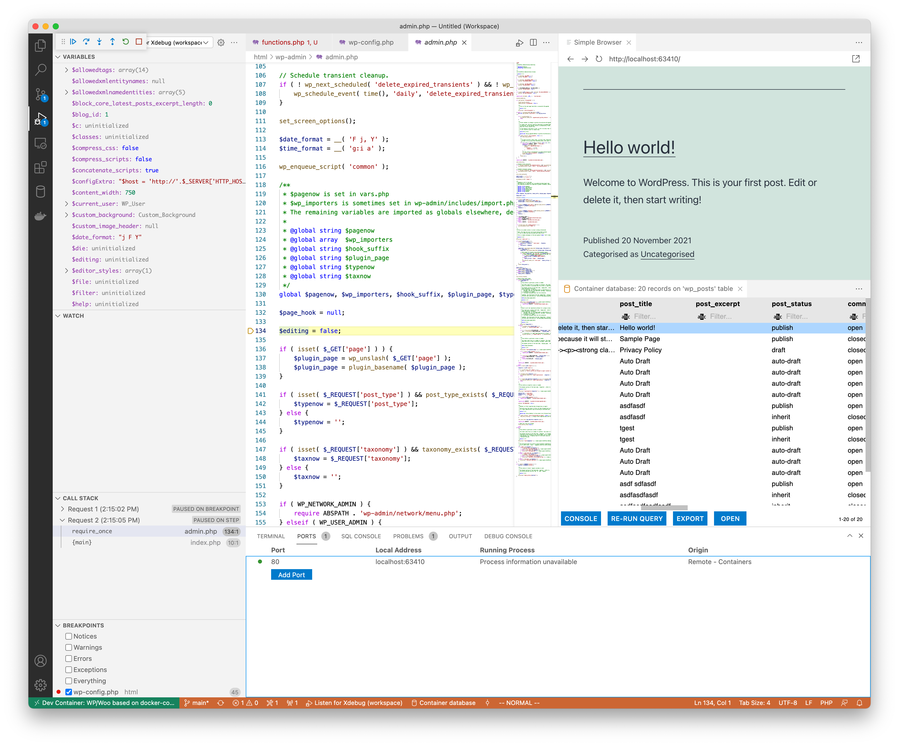

# vscode-wordpress
Devcontainer scripts to develop Wordpress extensions or sites using VSCode remote containers, with battery includes.

It should work on codespaces too.

It extends the `wordpress` docker image with, `xdebug`, `wpcli`, `composer`, `mysql`, `node`, 
and most common sense linux utils like `curl`, `zsh`, `bash`, `ssh`, `ag`, ...  
It is tested on MacOS M1 and avoid common performance issues that you will run in to using the vanilla `wordpress` docker image.




## Usage

The way vary depending on the structure of your repository and it contents. 
Below you will find the most common examples, you can copy the relevant line to
`.devcontainer/devcontainer.json` to `postStartCommand`.

## How to access the wordpress code
The wordpress code is located in /var/www/html. If you want to easily access it. You can make a link in your worksace as follows:
```
ln -s /var/www/html /workspace/html
```
Or add the folder to your workspace. The only drawnback I've notices is that the command `reopen in local folder` will stop working.
```
code -a /var/www/html
```


## Plugin or Theme development
If your repository contains a plugin source you can run (change the `my-plugin` to something that works for you)

```sh
ln -fs /workspace /var/www/html/wp-content/plugins/my-plugin
```

If your repository contains a theme set `postStartCommand` to:

```sh
ln -fs /workspace /var/www/html/wp-content/themes/my-theme
```

## Full wordpress installation
If your repository contains a full wordpress installation with all plugins and themes, the usage is more complicated.

### on Linux
The volume `/workspace` is fast enough so you can simply replace `/var/www/html/wp-content` with a link to your `wp-content`.

### on Macos
The volume `/workspace` is too slow (see Speed section), you have two options.

- Link only the necessary folders, and copy the rest to `/var/www/html/wp-content`
```sh
rsync -s /workspace/html/wp-content /var/www/html/wp-content

# if you want to edit your theme
ln -sf /workspace/html/wp-content/themes/your-theme  /var/www/html/wp-content/themes/your-theme
# This is a bit much to put in to the postStartCommand so you will need to create a script.
```

- Use vscode `Clone repository in Named Container Volume...`, and follow the Linux instructions.
For this to work unfortunately you will have to chagne the `.devcontianer/docker-compose.yml`
Instruction will follow.

### on Windows
I'm not sure how fast is the bind mount and I don't have a way to test, so use linux version if it doesn't work fall back to macos. 

## Speed consideration on MacOS
The access to a bind mounted workspace folder on MacOs is 10x solwer than access to volumes.
This makes serving wordpress directly from such mounted volume an impossibly slow (10sec to load a homepage).
The old options to solve this issue like :cached or :delegated are gone with the gRPC-FUSE driver see https://github.com/docker/for-mac/issues/5402


### Workaround on for everchanging ports
The vscode option to forward ports picks a random unused port when fowarding containers ports.
This is quite good idea as it let you have mutliple instances runinng in parallel and it is the only way to forward ports in codespaces.
However this breaks wordpress as it will remember the first used port and try to redirect user to that port each time the 
request comes from a different url.

The way to fix this is to add a dynamic WP_HOME and WP_SITEURL as follows:
```php
$host = 'http://'.$_SERVER['HTTP_HOST'].'/';
define( 'WP_HOME',  $host); 
define( 'WP_SITEURL', $host);
```
It is done by default in this repository in the .devcontainer/docker-compose.yml

If you worreid that the links are still being preserved in the database and some plugins may not respect WP_HOME and WP_SITEURL settings run the wpcli replace command as follows:
```sh
wp search-replace --regex 'http://localhost:[0-9]*' 'http://localhost:8080' --regex
```

Change the :8080 to your port.

# Thanks

I've based intial docker compose on this repo:
https://github.com/nezhar/wordpress-docker-compose/issues/76
